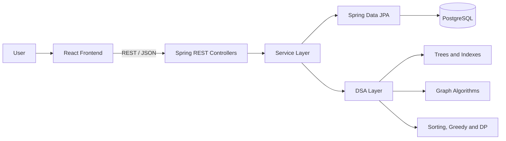

# Architecture

## Backend layers

- **Controller:** HTTP endpoints and request validation
- **Service:** business rules, transactions, recommendations, analytics
- **Repository:** Spring Data JPA interfaces
- **Domain:** database entities
- **DSA:** original Java algorithm implementations
- **Configuration:** CORS and sample-data initialization

## Data flow example: borrow a book

1. React sends member ID and book ID.
2. `LoanController` validates the request body.
3. `LoanService` checks member activity, borrowing limit, and book availability.
4. A transaction is saved in PostgreSQL.
5. Book availability and popularity count are updated in the same transaction.
6. The response is displayed in React.
